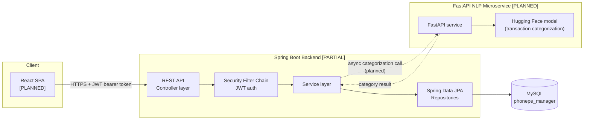
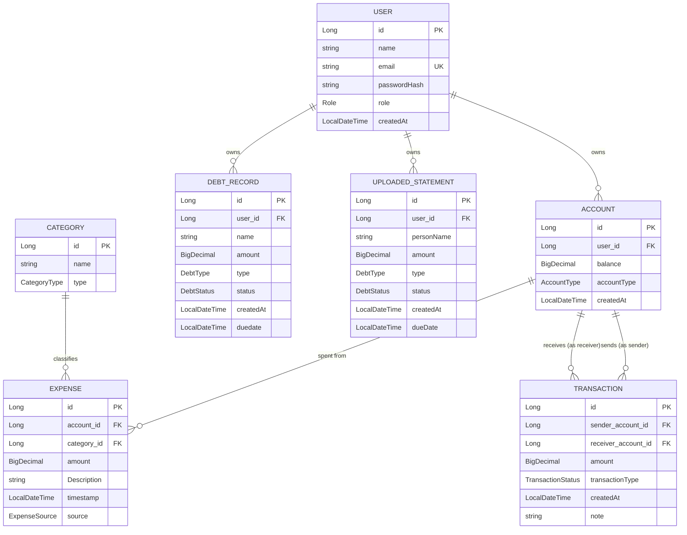
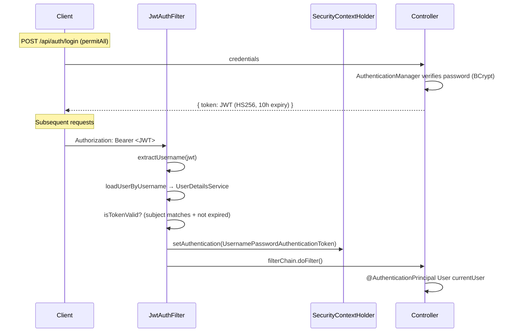

# SpendWise / PhonePe Manager — Architecture

This document describes the system as it exists today, plus the parts of the
target architecture (from the project's stated scope) that are not built yet.
Status tags on every component: **[DONE]**, **[PARTIAL]**, **[PLANNED]**.

---

## 1. System context



Only the **Spring Boot Backend** and **MySQL** boxes exist in this repo today.
The React SPA and FastAPI/Hugging Face service are referenced in the project
scope but have no code yet — see [§6 Roadmap](#6-roadmap--gaps).

---

## 2. Backend layering

Standard layered architecture, one package per layer:

```
com.Bhawesh.expense_tracker
├── Controller/     REST endpoints — request/response only, no business logic
├── service/        Business logic, transaction boundaries (@Transactional)
├── repository/      Spring Data JPA interfaces — persistence only
├── entity/          JPA-mapped domain objects
├── dto/             Request/response payloads (validation lives here via jakarta.validation)
├── enums/           Fixed vocabularies used by entities/dto
├── security/         JwtService (issue/verify tokens), JwtAuthFilter (per-request auth)
└── config/           SecurityConfig, JwtConfig, CorsConfig — wiring, not logic
```

Dependency direction is one-way: `Controller → service → repository → entity`.
DTOs cross the Controller boundary; entities never leave the service layer
(with the current exception of controllers returning entities directly instead
of response DTOs — see known issues).

### Component status per feature

| Feature       | Entity | Repository | Service | Controller | Notes |
|---------------|:---:|:---:|:---:|:---:|---|
| Auth (register/login) | [DONE] `User` | [DONE] | [DONE] `AuthService` | [DONE] `/api/auth/**` | JWT issued on register + login |
| Account | [DONE] | [DONE] (buggy, see §5) | [DONE] create-only | [DONE] create-only | No list/get/update/delete |
| Expense | [DONE] | [DONE] | [DONE] incl. update/delete | [PARTIAL] create/read only | update/delete exist in service, not exposed |
| Transaction (transfer) | [DONE] | [DONE] | [DONE] | [DONE] | Sender-ownership check present |
| Category | [DONE] | [DONE] | [MISSING] | [MISSING] | No way to create categories via API |
| DebtRecord | [DONE] | [DONE] | [MISSING] | [MISSING] | Modeled, unbuilt |
| UploadedStatement | [DONE] | [DONE] | [MISSING] | [MISSING] | Needed for PDF statement upload (Phase 2) |
| Bulk PDF import | — | — | [DONE] `ExpensePdfService` | [MISSING] | Service exists, nothing calls it |
| Analytics/KPI | — | — | [MISSING] | [MISSING] | Needed to feed Recharts dashboard |
| NLP categorization | — | — | [MISSING] (Python) | [MISSING] | Separate FastAPI service, not started |

---

## 3. Data model (entities as currently mapped)



**Enums:** `Role{USER,ADMIN}` · `AccountType{WALLET,BANK,CASH,SAVINGS}` ·
`CategoryType{EXPENSE,INCOME}` · `ExpenseSource{MANUAL,PDF_IMPORT}` ·
`TransactionStatus{SUCCESS,FAILED,PENDING}` ·
`DebtType{BORROWED,DEBT}` · `DebtStatus{PENDING,STATUS,OVERDUE}` ⚠️ (`STATUS` looks like a placeholder, not a real status)

`UploadedStatement` currently reuses `DebtType`/`DebtStatus`, which are debt
vocabularies, not upload-processing vocabularies (`PENDING`/`PROCESSED`/`FAILED`
would fit its actual purpose better). Flagged for Phase 2.

---

## 4. Security architecture

Stateless JWT auth, no server-side sessions.



- `SecurityConfig`: stateless session policy, CSRF disabled (appropriate for a
  pure JWT API), `/api/auth/**` and `/error` are the only `permitAll` routes,
  everything else requires authentication. **No role-based (`hasRole`)
  restrictions exist yet** — `Role.ADMIN` is modeled but unenforced.
- `JwtService`: signs/verifies HS256 tokens using a secret from
  `security.jwt.secret-key`.
- `CorsConfig`: allows configured origins on `/api/**` only — note this does
  **not** cover `/accounts`, which isn't under `/api` (see §5).

---

## 5. Known architectural inconsistencies

These aren't Phase 1 line-items already covered — they're structural things
worth knowing while reading the rest of the codebase:

1. **Routing convention is inconsistent.** `AuthController`, `ExpenseController`,
   `TransactionController` all live under `/api/...`. `AccountController` lives
   at `/accounts` (no `/api` prefix). This means `CorsConfig`'s `/api/**`
   mapping silently doesn't apply to account endpoints from a browser client.
2. **No ownership scoping on `Expense` reads** (`getAllExpense`,
   `getExpenseById`, `getExpensesByAccount` return/allow lookup of any user's
   data) — the same pattern `TransactionService` already gets right for
   transfers isn't applied to expenses yet.
3. **Controllers return JPA entities directly** (e.g. `ResponseEntity<Expense>`,
   `ResponseEntity<Transaction>`) instead of response DTOs. Works today, but
   couples the wire format to the persistence model and will over-serialize
   lazy associations (`Account.expenses`, `User.accounts`, etc.) once those
   relationships are populated.
4. **Secrets committed in plaintext** in `application.properties` (DB
   password, JWT signing key) — `spring-dotenv` is a declared dependency but
   no `.env` is actually used yet.

---

## 6. Roadmap / gaps

Maps to the phased plan already agreed for this project:

- **Phase 1** — close CRUD gaps (Category, Account, DebtRecord), wire orphaned
  Expense update/delete and bulk-import code, add global exception handling,
  fix the bugs in §5.
- **Phase 2** — real PDF statement upload/parsing, `UploadedStatement`
  service/controller.
- **Phase 3** — analytics/KPI aggregation endpoints (spend-by-category,
  monthly trend, income vs. expense) to feed the dashboard.
- **Phase 4** — FastAPI + Hugging Face microservice for NLP transaction
  categorization, called asynchronously from the Spring Boot service layer.
- **Phase 5** — React SPA (auth, CRUD screens, Recharts dashboard).
- **Phase 6** — role-based authorization enforcement, Docker Compose for the
  full stack, secret rotation.

This document should be updated as each phase lands so it stays a true
reflection of the system rather than a snapshot of intent.
