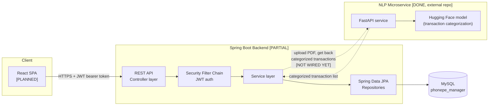
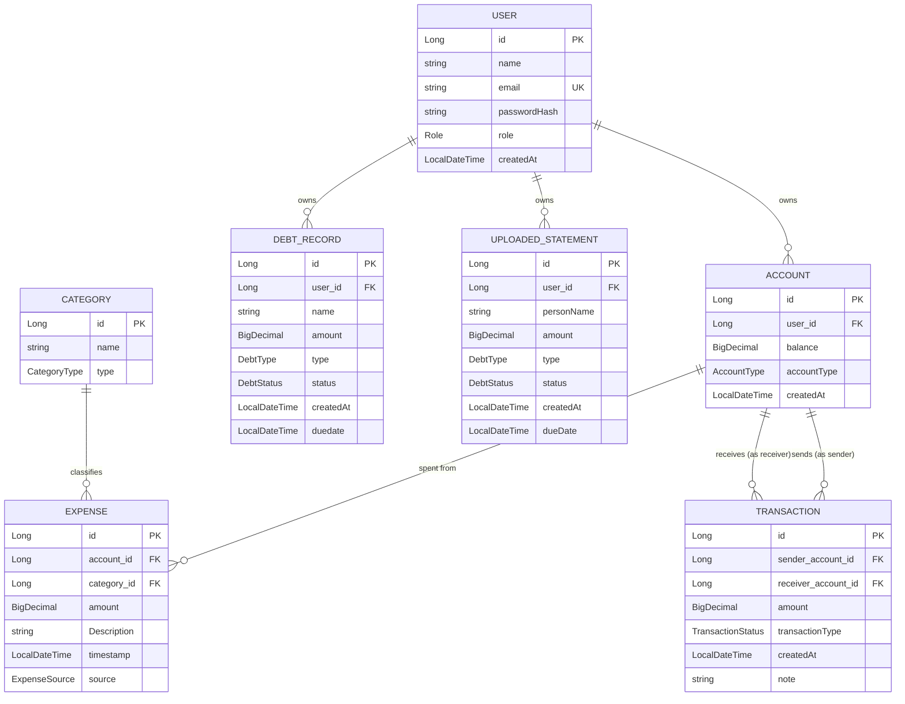
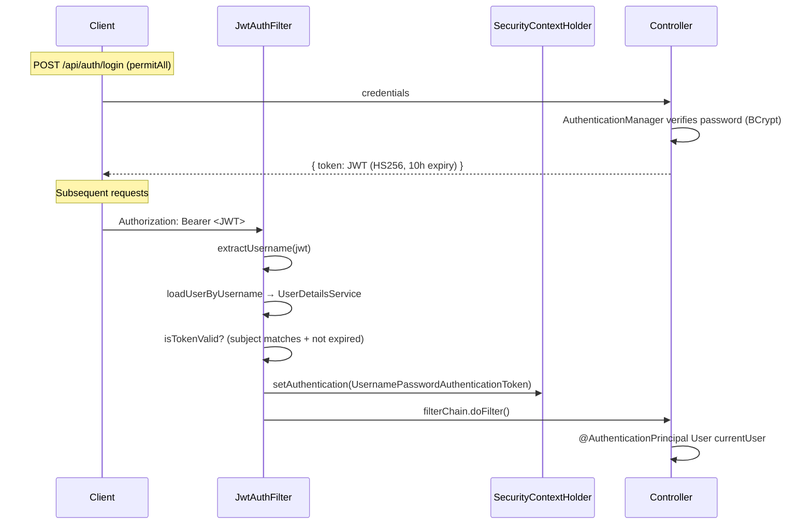

# SpendWise / PhonePe Manager — Architecture

## 0. Product vision

Personal expense tracker. A user gets to their spend data two ways:

1. **Manual entry** — user logs an expense/transaction directly via the app.
2. **Bank statement upload** — user uploads a bank statement PDF; the system
   auto-detects the transactions in it, categorizes them, and reflects them
   in the app without manual entry.

The categorization for path (2) is done by a separate NLP microservice
(FastAPI + Hugging Face model), already built and working in its own repo.
This repo (Spring Boot backend) does not yet call it — that wiring is the
next integration milestone (Phase 2 below).

This document describes the system as it exists today, plus the parts of the
target architecture that are not built yet. Status tags on every component:
**[DONE]**, **[PARTIAL]**, **[MISSING]**, **[PLANNED]**.

---

## 1. System context



Only the **Spring Boot Backend** and **MySQL** boxes exist in this repo.
The NLP microservice is real and working, but lives in a separate repo and
is not yet called from this backend. The React SPA has no code yet.
See [§6 Roadmap](#6-roadmap--gaps).

---

## 2. Backend layering

Standard layered architecture, one package per layer:

```
com.Bhawesh.expense_tracker
├── Controller/     REST endpoints — request/response only, no business logic
├── service/        Business logic, transaction boundaries (@Transactional)
├── repository/      Spring Data JPA interfaces — persistence only
├── entity/          JPA-mapped domain objects
├── dto/             Request/response payloads (validation lives here via jakarta.validation)
├── enums/           Fixed vocabularies used by entities/dto
├── security/         JwtService (issue/verify tokens), JwtAuthFilter (per-request auth)
└── config/           SecurityConfig, JwtConfig, CorsConfig — wiring, not logic
```

Dependency direction is one-way: `Controller → service → repository → entity`.
DTOs cross the Controller boundary; entities never leave the service layer
(with the current exception of controllers returning entities directly instead
of response DTOs — see known issues).

### Component status per feature

| Feature       | Entity | Repository | Service | Controller | Notes |
|---------------|:---:|:---:|:---:|:---:|---|
| Auth (register/login) | [DONE] `User` | [DONE] | [DONE] `AuthService` | [DONE] `/api/auth/**` | JWT issued on register + login |
| Account | [DONE] | [DONE] | [DONE] create + list-by-user | [PARTIAL] `/api/accounts` | No get-by-id/update/delete yet |
| Expense | [DONE] | [DONE] | [DONE] full CRUD | [DONE] `/api/expenses` | create/get-mine/get-all(admin)/get-by-id/get-by-account/update/delete, ownership-scoped |
| Transaction (transfer) | [DONE] | [DONE] | [DONE] | [DONE] `/api/transactions` | Sender-ownership check present |
| Category | [DONE] | [DONE] | [MISSING] | [MISSING] | No way to create categories via API — blocks manual Expense creation, which requires a `categoryId` |
| DebtRecord | [DONE] | [DONE] | [MISSING] | [MISSING] | Modeled, unbuilt |
| UploadedStatement | [DONE] (mismodeled, see §5) | [DONE] | [MISSING] | [MISSING] | Needed to track PDF-upload status (Phase 2) |
| Bulk PDF import (backend side) | — | — | [PARTIAL] `ExpensePdfService.SaveBulkExpenses` | [MISSING] | Takes an already-categorized `List<TransactionDTO>` + accountId and persists as `Expense` rows with `source=PDF_IMPORT`. Nothing calls it yet — no controller, no HTTP client to the microservice |
| NLP categorization | — | — | [DONE], external repo | — | Separate FastAPI + Hugging Face service, accepts PDF upload directly, returns categorized transactions. Working, not yet called from this backend |
| Analytics/KPI | — | — | [MISSING] | [MISSING] | Needed to feed Recharts dashboard |

---

## 3. Data model (entities as currently mapped)



**Enums:** `Role{USER,ADMIN}` · `AccountType{WALLET,BANK,CASH,SAVINGS}` ·
`CategoryType{EXPENSE,INCOME}` · `ExpenseSource{MANUAL,PDF_IMPORT}` ·
`TransactionStatus{SUCCESS,FAILED,PENDING}` ·
`DebtType{BORROWED,DEBT}` · `DebtStatus{PENDING,STATUS,OVERDUE}` ⚠️ (`STATUS` looks like a placeholder, not a real status)

`UploadedStatement` currently reuses `DebtType`/`DebtStatus`/`personName`/
`dueDate` — those are debt-tracking fields, not statement-upload-tracking
fields. What it actually needs: `fileName`, upload/process timestamps,
a `PENDING|PROCESSED|FAILED` status, and a count of transactions imported.
Needs remodeling before Phase 2 lands.

---

## 4. Security architecture

Stateless JWT auth, no server-side sessions.



- `SecurityConfig`: stateless session policy, CSRF disabled (appropriate for a
  pure JWT API), `/api/auth/**` and `/error` are the only `permitAll` routes,
  everything else requires authentication. `Role.ADMIN` is enforced via
  `@PreAuthorize` on `ExpenseService.getAllExpense` — the first real use of
  RBAC in the codebase, though it's not yet applied consistently elsewhere.
- `JwtService`: signs/verifies HS256 tokens using a secret from
  `security.jwt.secret-key`.
- `CorsConfig`: allows configured origins on `/api/**` only. All controllers
  now live under `/api/**` (routing inconsistency from earlier is fixed —
  `AccountController` moved to `/api/accounts`).

---

## 5. Known architectural inconsistencies

1. **Controllers return JPA entities directly** (e.g. `ResponseEntity<Expense>`,
   `ResponseEntity<Transaction>`, `ResponseEntity<Account>`) instead of response
   DTOs. Works today, but couples the wire format to the persistence model and
   will over-serialize lazy associations (`Account.expenses`, `User.accounts`,
   etc.) once those relationships are populated.
2. **Secrets fix in progress**: DB password/JWT key were committed in
   plaintext in `application.properties`; a working-tree change (uncommitted
   as of this writing) moves them to `.env` via Spring's native
   `spring.config.import=optional:file:.env[.properties]`, replacing the
   now-unneeded `spring-dotenv` dependency. Needs to land as a commit.
3. **`UploadedStatement` entity is mismodeled** — see §3. Reuses debt
   vocabulary (`DebtType`/`DebtStatus`/`personName`/`dueDate`) instead of
   upload-tracking fields. Must be fixed before Phase 2 work starts, since
   Phase 2 is exactly "make PDF upload work end-to-end."
4. **`DebtStatus.STATUS`** enum value looks like a placeholder left in by
   mistake, not an intentional status.

---

## 6. Roadmap / gaps

- **Phase 1 (current)** — close CRUD gaps: `Category` service/controller
  (blocking — Expense creation requires a `categoryId`), `Account`
  get/update/delete, `DebtRecord` service/controller. Fix §5 items 1–2
  (DTO responses, land the secrets-to-`.env` change).
- **Phase 2 (next)** — wire the PDF-upload flow end-to-end:
  remodel `UploadedStatement` to fit its actual purpose (§3/§5.3); add
  `POST /api/statements/upload` (multipart PDF) that forwards the file to
  the external NLP microservice, receives back categorized transactions,
  maps category names to internal `Category` ids, creates the
  `UploadedStatement` tracking record, and calls
  `ExpensePdfService.SaveBulkExpenses` to persist them as `Expense` rows
  with `source=PDF_IMPORT`.
- **Phase 3** — analytics/KPI aggregation endpoints (spend-by-category,
  monthly trend, income vs. expense) to feed the dashboard.
- **Phase 4** — React SPA: auth, manual-entry screens, PDF upload UI,
  Recharts dashboard consuming Phase 3's endpoints.
- **Phase 5** — RBAC enforcement made consistent across all endpoints
  (not just `getAllExpense`), Docker Compose bundling Spring Boot + MySQL +
  the NLP microservice, secret rotation for production.

This document should be updated as each phase lands so it stays a true
reflection of the system rather than a snapshot of intent.
