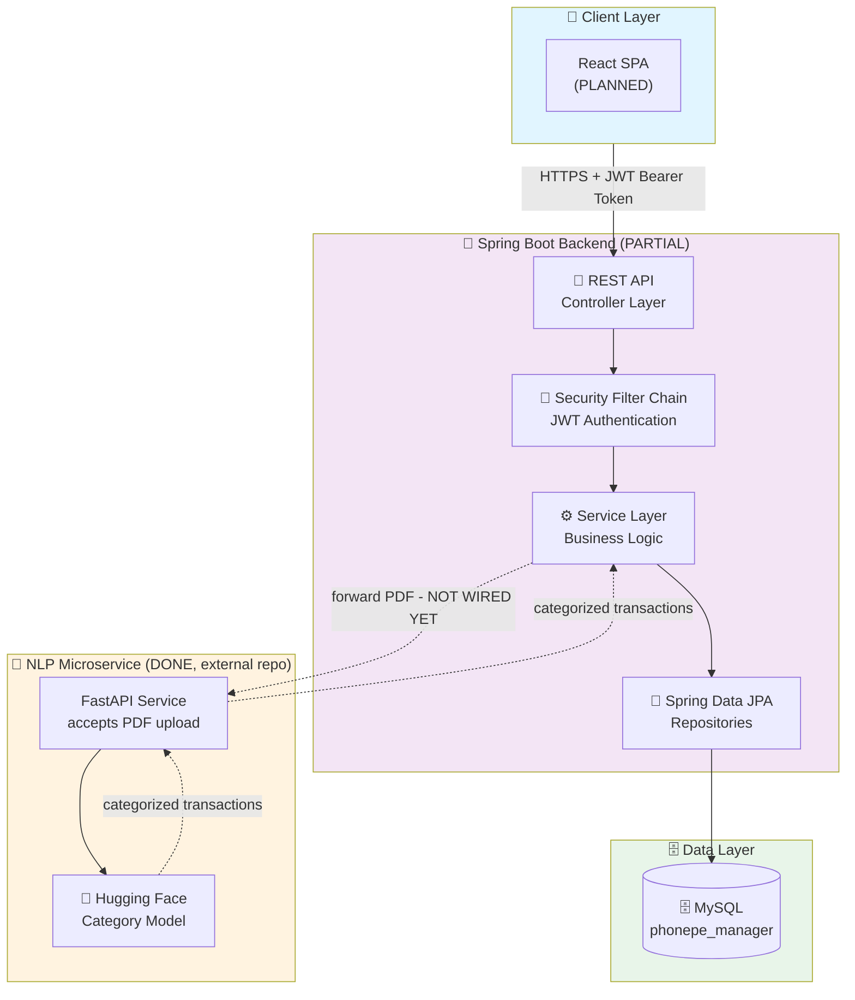
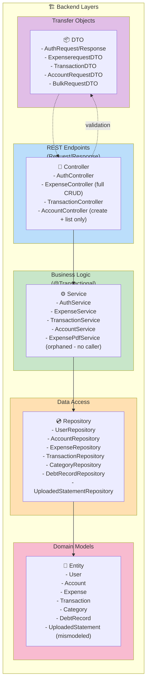
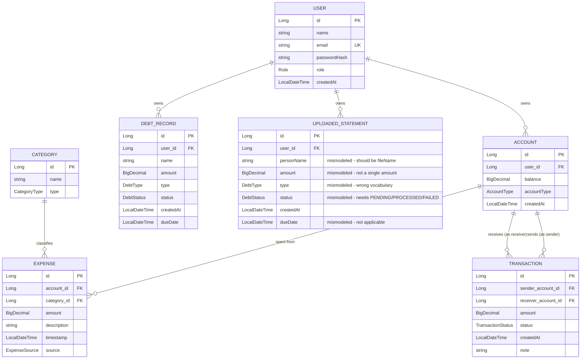
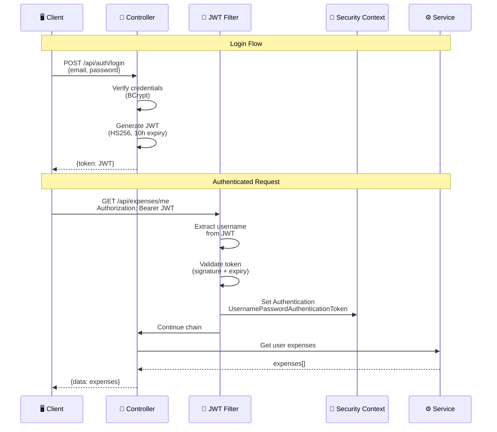
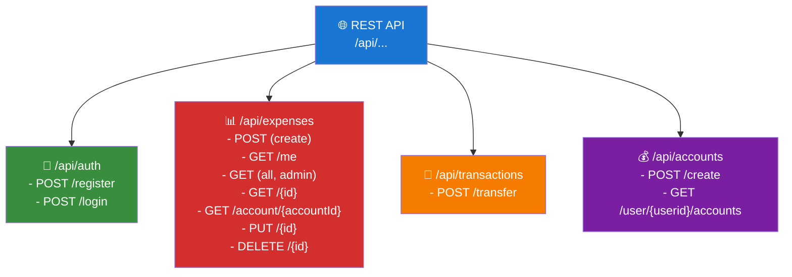

# PhonePe Manager - System Architecture Diagram

## 0. Product Vision

Personal expense tracker. Two ways to get expenses in:

1. **Manual entry** — user logs a transaction directly.
2. **Bank statement upload** — user uploads a PDF; the system auto-detects
   the transactions inside it, categorizes them, and reflects them in the app.

Categorization (path 2) is handled by a separate NLP microservice (FastAPI +
Hugging Face), already built and working in its own repo. It accepts an
uploaded PDF directly and returns a categorized transaction list. This
Spring Boot backend does not call it yet — that's the next integration
milestone.

---

## 1. High-Level System Architecture



---

## 2. Backend Layered Architecture



---

## 3. Data Model - Entity Relationships



---

## 4. Security Flow - JWT Authentication



---

## 5. Component Status Matrix

| Feature | Entity | Repository | Service | Controller | Status |
|---------|:------:|:----------:|:-------:|:----------:|:------:|
| **Auth** | ✅ | ✅ | ✅ | ✅ | DONE |
| **Account** | ✅ | ✅ | ✅ | ⚠️ create + list only | PARTIAL |
| **Expense** | ✅ | ✅ | ✅ | ✅ full CRUD | DONE |
| **Transaction** | ✅ | ✅ | ✅ | ✅ | DONE |
| **Category** | ✅ | ✅ | ❌ | ❌ | MISSING (blocks Expense creation) |
| **DebtRecord** | ✅ | ✅ | ❌ | ❌ | MISSING |
| **UploadedStatement** | ⚠️ mismodeled | ✅ | ❌ | ❌ | MISSING |
| **Bulk PDF Import (backend)** | - | - | ✅ | ❌ | PARTIAL - nothing calls the service |
| **NLP Categorization** | - | - | ✅ external repo | - | DONE, not yet integrated from this backend |
| **Analytics/KPI** | - | - | ❌ | ❌ | MISSING |

---

## 6. API Endpoints Overview



---

## 7. Enums Reference

```
🔤 Role:              USER | ADMIN
💳 AccountType:       WALLET | BANK | CASH | SAVINGS
📁 CategoryType:      EXPENSE | INCOME
📤 ExpenseSource:     MANUAL | PDF_IMPORT
✅ TransactionStatus: SUCCESS | FAILED | PENDING
💳 DebtType:          BORROWED | DEBT
⏳ DebtStatus:        PENDING | STATUS | OVERDUE  ⚠️ STATUS looks like a placeholder
```

---

## 8. Known Issues & Roadmap

### Current Issues
- ⚠️ Controllers return JPA entities instead of DTOs (over-serialization risk on lazy relations)
- ⚠️ Secrets-to-`.env` fix drafted but not committed yet
- ⚠️ `UploadedStatement` entity reuses debt vocabulary — needs remodeling before Phase 2
- ⚠️ `DebtStatus.STATUS` looks like a placeholder value

### Roadmap

| Phase | Features |
|-------|----------|
| **Phase 1 (current)** | Category service/controller (blocking), Account get/update/delete, DebtRecord service/controller, DTO responses, land secrets fix |
| **Phase 2 (next)** | Remodel `UploadedStatement`; `POST /api/statements/upload`; forward PDF to external NLP microservice; map returned categories to internal `Category` ids; call `ExpensePdfService.SaveBulkExpenses` |
| **Phase 3** | Analytics & KPI endpoints for dashboard (spend-by-category, monthly trend, income vs expense) |
| **Phase 4** | React SPA — auth, manual entry, PDF upload UI, Recharts dashboard |
| **Phase 5** | Consistent RBAC enforcement, Docker Compose (Spring Boot + MySQL + NLP microservice), secret rotation |

---

**Last Updated:** 2026-07-31
