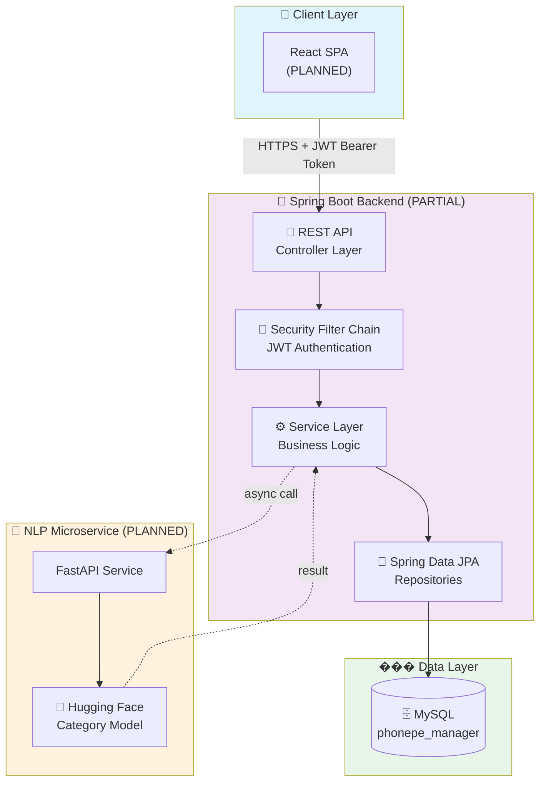
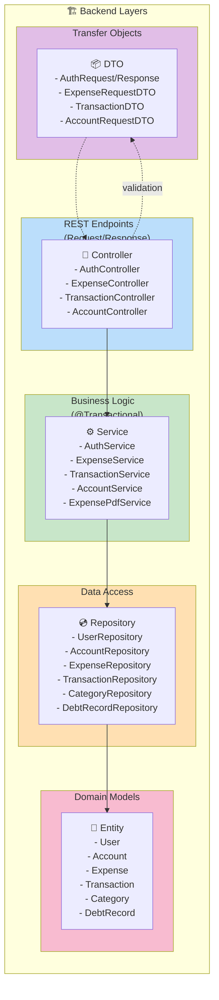
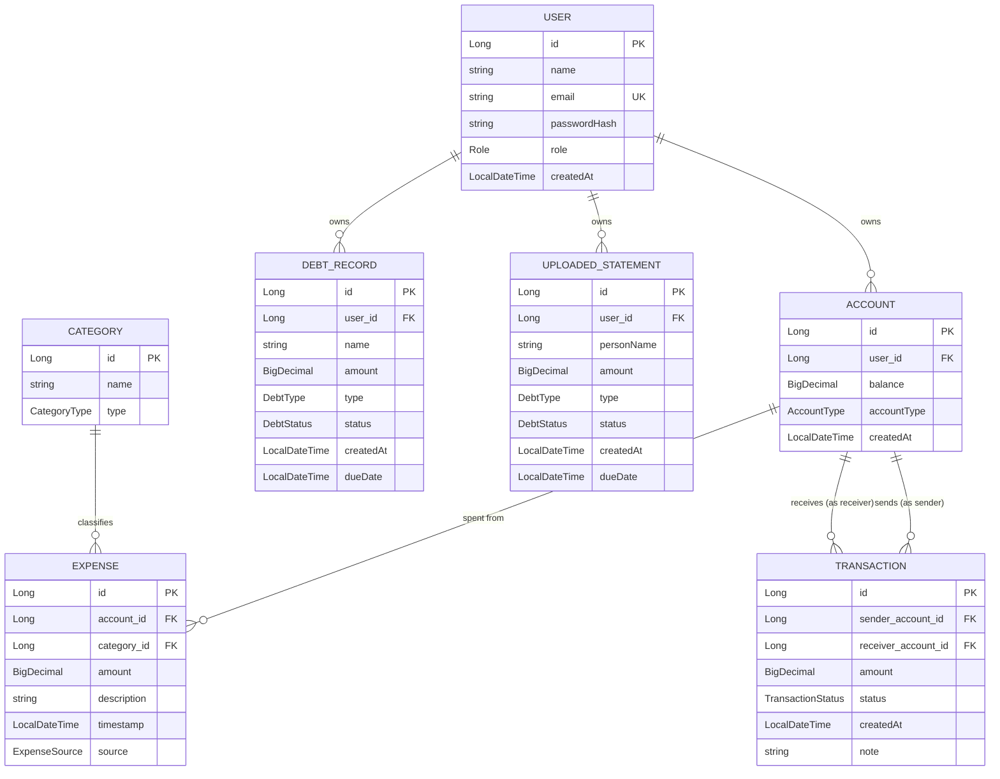
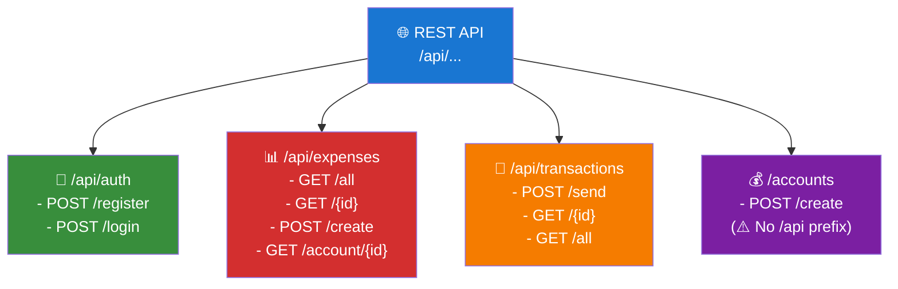

# PhonePe Manager - System Architecture Diagram

## 1. High-Level System Architecture



---

## 2. Backend Layered Architecture



---

## 3. Data Model - Entity Relationships



---

## 4. Security Flow - JWT Authentication


---

## 5. Component Status Matrix

| Feature | Entity | Repository | Service | Controller | Status |
|---------|:------:|:----------:|:-------:|:----------:|:------:|
| **Auth** | ✅ | ✅ | ✅ | ✅ | DONE |
| **Account** | ✅ | ⚠️ | ✅ | ✅ | PARTIAL |
| **Expense** | ✅ | ✅ | ✅ | ⚠️ | PARTIAL |
| **Transaction** | ✅ | ✅ | ✅ | ✅ | DONE |
| **Category** | ✅ | ✅ | ❌ | ❌ | MISSING |
| **DebtRecord** | ✅ | ✅ | ❌ | ❌ | MISSING |
| **UploadedStatement** | ✅ | ✅ | ❌ | ❌ | MISSING |
| **Bulk PDF Import** | - | - | ✅ | ❌ | PARTIAL |
| **Analytics/KPI** | - | - | ❌ | ❌ | MISSING |
| **NLP Categorization** | - | - | ❌ (Python) | ❌ | MISSING |

---

## 6. API Endpoints Overview



---

## 7. Enums Reference

```
🔤 Role:              USER | ADMIN
💳 AccountType:       WALLET | BANK | CASH | SAVINGS
📁 CategoryType:      EXPENSE | INCOME
📤 ExpenseSource:     MANUAL | PDF_IMPORT
✅ TransactionStatus: SUCCESS | FAILED | PENDING
💳 DebtType:          BORROWED | DEBT
⏳ DebtStatus:        PENDING | STATUS | OVERDUE
```

---

## 8. Known Issues & Roadmap

### Current Issues (§5)
- ❌ Inconsistent routing (`/api/**` vs `/accounts`)
- ❌ No ownership scoping on Expense reads
- ❌ Controllers return JPA entities instead of DTOs
- ❌ Secrets hardcoded in `application.properties`

### Roadmap

| Phase | Features | Timeline |
|-------|----------|----------|
| **Phase 1** | CRUD gaps (Category, Account, DebtRecord), wire bulk import, fix inconsistencies | Current |
| **Phase 2** | PDF statement upload/parsing, UploadedStatement service | Next |
| **Phase 3** | Analytics & KPI endpoints for dashboard | Q3 2026 |
| **Phase 4** | FastAPI + Hugging Face NLP service | Q4 2026 |
| **Phase 5** | React SPA frontend | Q4 2026 |
| **Phase 6** | RBAC, Docker Compose, secret rotation | Q1 2027 |

---

**Last Updated:** July 2026  
**Status:** Architecture Phase 1 (In Progress)
